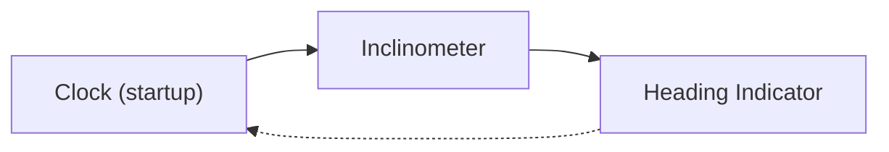

# GMR Land-o-Meter

This project replicates the analog dashboard clock found in many late aughts and early teens Land
Rovers, with the addition of the following information displays:

- Inclinometer with both roll and pitch
- Heading indicator

Both of those instruments are modeled after aircraft instruments (attitude and heading indicators)
since the author is a pilot and that aesthetic is of interest. Some liberty is taken to better
adapt the attitude indicator for use in a ground-based vehicle, i.e. the fixed vehicle banks
rather than the false horizon banking. Pitch and heading are indicated normally.

The microcontroller will automatically go to sleep, turning the screen and IMU off when there
ceases to be any activity on the vehicle's LIN bus. This is roughly five minutes after turning
off and/or locking the vehicle. The microcontroller will then automatically wakeup when new
activity is detected on the LIN bus, i.e. when it is unlocked and a door opened.

## Operation

The user may single-tap on any screen to cycle to the next mode. The cycle order is:

### Deep Sleep

Sleep mode may be manually entered on any screen by triple-tapping.

### Clock

While on the clock screen, the following operations are allowed:

| Double-Tap | Long-Press |
|------------|------------|
| Resynchronize RTC time from the vehicle's LIN bus. | Enter manual RTC setting mode. Arrows on the screen are drawn to indicate where to press to increment the minutes and hours up or down. Tapping the respective arrow increments the respective time element by one. This mode is automatically exited after several seconds of inactivity (no taps on screen). |

### IMU Instruments

A double-tap in either inclineter or heading modes will re-initialize the IMU, which can be useful
in case the microcontroller stops receiving data from it.

## Project Dependencies
- https://github.com/Seeed-Studio/Seeed_Arduino_RoundDisplay
- https://github.com/lvgl/lvgl
- https://github.com/atgrier/Seeed_Arduino_LCD
- https://github.com/atgrier/ESP32-SoftwareLIN
- https://github.com/atgrier/espsoftwareserial
- https://github.com/sparkfun/SparkFun_ICM-20948_ArduinoLibrary
- https://github.com/tanakamasayuki/I2C_BM8563
